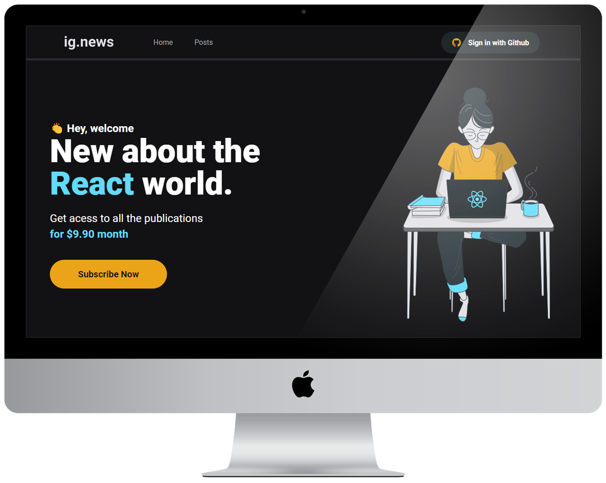

<h1 align="center">
    
</h1>

<p align="center">
  <a href="#desktop_computer-projeto"></a>&nbsp;
  <a href="#nail_care-layout"></a>&nbsp;
  <a href="#technologist-tecnologias"></a>
  <a href="#octocat-ambiente"></a>&nbsp;
  <a href="#bookmark_tabs-licença"></a>&nbsp;
</p>

<p align="center">
 
</p>

<br>
<hr>

## :desktop_computer: Projeto

<strong>Ignews</strong> é um serviço de assinatura que disponibiliza aos usuários determinado conteúdo. 

Esta aplicação foi criada com o intuito de aprofundar conhecimentos em front-end no curso Ignite da [@Rocketseat](https://app.rocketseat.com.br/).


Desenvolvendo essa aplicação foi possível aprofundar conhecimentos em: 
<br>

- React-Components,
- React-Props,
- React-Hooks,
- SEO (Search Engine Optimization),
- SPA (Single-page Application), 
- SSR (Server-side Rendering), 
- SSG (Static site Generation), 
- OAuth,
- Integrações com API,
- API routes,
- Webwooks,
- css-modules & SASS,
- Axios.

<hr>

[FaunaDB](https://fauna.com/) foi escolhido como banco de dados pois atende bem aplicações serverless.
<br>

O cliente que contrata o serviço, realiza um pagamento mensal via [Stripe](https://stripe.com/br) e pode desfrutar dos benefícios pelo tempo que desejar a continuidade da assinatura.
<br>

Através do [Prismic](https://prismic.io/) CMS, é possível gerenciar conteúdo de forma simples e intuitiva.
<hr>

>Você pode conferir algumas anotações no arquivo [notes](./notes.md). <br>

> `Alerta:` Por conta de alguns recursos na estilização não é recomendado utilizar IE 6-8 como browser ao utilizar essa aplicação.

<hr>
<br>

## :nail_care: Layout
<p align="center">


</p>

<h4 align="center">Você pode verificar o layoult desenvolvido por <a href="https://www.instagram.com/tiagoluchtenberg/?hl=pt-br">@TiagoLuchtenberg</a> acessando o <a href="https://www.figma.com/file/gl0fHkQgvaUfXNjuwGtDDs/ig.news?node-id=1%3A2">FIGMA</a>.</h4>

<br>
<br>
<hr>

## :technologist: Tecnologias

- [Next.js](https://nextjs.org/)
- [React](https://pt-br.reactjs.org/)
- [Typescript](https://www.typescriptlang.org/)
- [Sass](https://sass-lang.com/)
- [Axios](https://github.com/axios/axios)
- [NextAuth.js](https://next-auth.js.org/getting-started/example)
- [FaunaDB](https://fauna.com/)
- [Stripe](https://stripe.com/br)
- [Prismic](https://prismic.io/)
- [NextAuth.js](https://next-auth.js.org/getting-started/example)


<br>
<hr>

## :octocat: Ambiente

1. Para o correto funcionamento desta web aplicação tenha em mente que será necessário as seguintes instalações:

- [Git](https://git-scm.com/book/pt-br/v2/Come%C3%A7ando-Instalando-o-Git)
- [Yarn](https://classic.yarnpkg.com/en/docs/install/#debian-stable)
- [Stripe CLI](https://stripe.com/docs/stripe-cli)

2. Será necessário criar uma conta para cada serviço externo:

- [FaunaDB](https://fauna.com/)
- [Stripe](https://stripe.com/br)
- [Prismic](https://prismic.io/)

3. É de extrema importância configurar os serviços externos seguindo o arquivo [notes](./notes.md).

```bash
As orientações estão nos últimos tópicos.
```

4. Clonar o repositório:

```bash
git@github.com:CaioLemec/ignews.git
```

5. Instale as dependências usando o comando:

```bash
 yarn
```

6. Na raiz do projeto crie uma copia do arquivo [.env.local.exemplo](./.env.local.exemplo). então altere o nome para `.env.local` 

```bash
 Siga as instruções para preencher as variaveis de ambiente necessárias. 
```

7. No seu terminal use um dos comandos para rodar a aplicação:

```bash
yarn dev  
yarn build   
```

8. Acesse o endereço em um browser compatível:

```bash
http://localhost:3000/
```

9. Você pode checar os eventos do webhook utilizando o comando:

```bash
stripe listen --forward-to localhost:3000/api/webhooks    
```

<br>
<hr>

## :bookmark_tabs: Licença

<br>

Projeto licenciado por MIT [LICENSE](./LICENSE).

<br>
<hr>
<br>

Fico à disposição para qualquer esclarecimento.


<h3>Caio Lemec<h3>
<a href="https://t.me/caiolemec">
<a href="mailto:caiolemec@gmail.com">
<a href="https://www.linkedin.com/in/caiolemec/">
<br>
</p>
