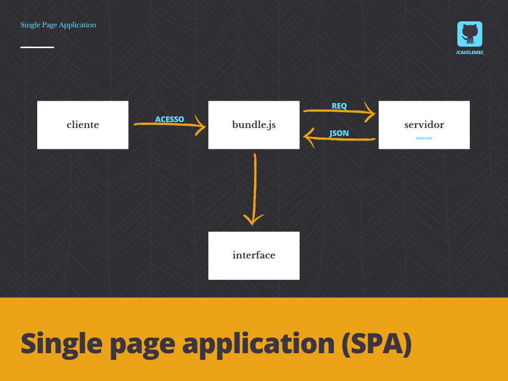
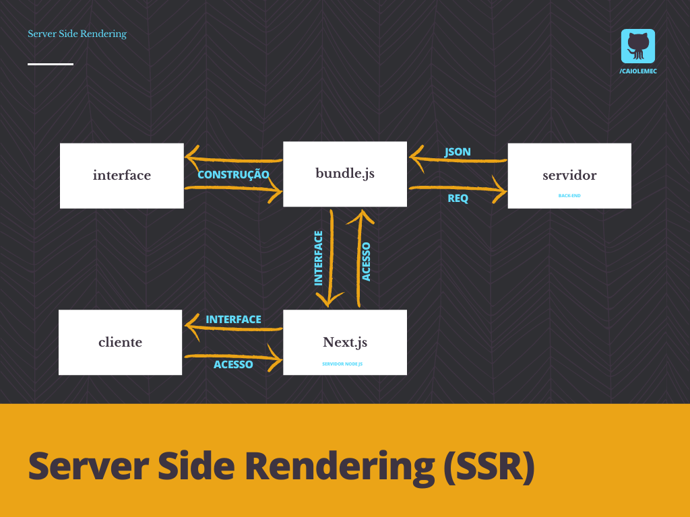

## NextJS

<h3>O que é o <b>Next.js</b>?</h3>

<b>Next.js</b> é caixa de ferramentas que irá auxiliar o desenvolvimento front-end principalmente somado com o uso da biblioteca React. Através dele é permitido realizar funcionalidades como renderização do lado do servidor e geração de sites estáticos para aplicativos da web.
<hr>
<br>

<h3>Por quê usar <b>Next.js</b>?</h3>

Para entender o motivo de usar <b>Next.js</b> é necessário primeiro entender conceitos básicos de <b>SEO</b>.
<br>
<b>SEO (Search Engine Optimization)</b>  é um conjunto de estratégias que tem como objetivo melhorar posicionamento nos resultados dos buscadores, ou seja, pode significar um maior número de acessos por proporcionar colocações superiores nos resultados de pesquisas nos buscadores.
<hr>
<br>

<h3>Como o <b>Next.js</b> pode me ajudar a melhorar uma dessas estratégias?</h3>

Crawler, é um robô usado pelos buscadores para encontrar e indexar páginas de um site. Ele captura informações das páginas e cadastra os links encontrados, possibilitando encontrar outras páginas e mantendo sua base de dados atualizada. Então visando otimizar resultados uma das estratégias é facilitar a vida desses robôs e fornecer tudo que eles precisarem quando for requisitado.

O grande problema é que muitos desses robôs, realizam essa "varredura" com a função de javascript desligada e ou não podem esperar o javascript renderizar os elementos dificultando tanto o SEO quanto usuários que possuem dispositivos móveis antigos e ou conexões fracas.

Vamos entender primeiro os conceitos de <b>SPA</b> e <b>SSR</b>:
<br>

<p align="center"><b>SPA (Single-page Application)</b>: São sempre executadas do lado do cliente (browser). O conteúdo de uma aplicação SPA é carregado completamente logo na primeira requisição. Exemplo: Github até a data que este conteúdo foi escrito.
<br>

</p>

<p align="center"><b>SSR (Server-side Rendering)</b>: O SSR é utilizado para resolver alguns dos problemas das aplicações SPAs porem, tentando manter suas principais vantagens. O SSR inverte o processo de renderização, trazendo uma parte do esforço de renderização de aplicações SPA para o servidor, de maneira similar ao carregamento tradicional.
<br>

</p>

Quando realizamos aplicações com react tradicional as interfaces são construídas pelo browser (SPA) e carregam seu conteúdo através de bundles, desta forma, motores de buscam podem ter problemas ao tentarem indexar conteúdos. Com o <b>Next.js</b> o código que renderiza a interface é executada por um servidor Node.js, o cliente vai ficar aguardando até o processo ser concluído. 

> O Next.js surgiu por conta do SSR, porem atualmente ele entrega muito além e é uma poderosa ferramenta para o front-end.
<hr>
<br>

<h3>Como usar <b>Next.js</b>?</h3>

Para criar uma estrutura usando <b>Next.js</b> basta usar o comando:

```bash
yarn create next-app nome-do-app
```

A estrutura criada será bem semelhante a criada com ```create react-app``` porem são adicionadas diversas funcionalidades, muitas delas automatizadas que ajudarão no desenvolvimento.

A pasta `pages` criada, não pode ser renomeada e sempre deverá ficar ou na raiz ou dentro de uma pasta SRC, isto pelo fato de cada arquivo que é atribuido a ela, vira automaticamente uma rota. Sendo assim, index sempre será o arquivo principal da aplicação. 

Arquivo _app é um componente que está por volta de todos outros componentes. Tudo que estiver dentro dele, será carregado assim houver uma troca na rota.

Arquivo _document é como se fosse o index em um projeto com React, nele serão feitas as implementações de coisas que ficarão estáticas mesmo ao trocar rota.

> Arquivos como _app e _document não viram rotas.
<hr>
<br>

<h3>Como adicionar <b>Typescript</b> no <b>Next.js</b></h3>

Para adicionar <b>Typescript</b> no <b>Next.js</b> basta usar o comando:

```bash
yarn add typescript @types/react @types/node -D
```
> @types/react & @types/node são para adicionar os pacotes de tipagem.

Após a instalação desses pacotes, basta alterar os arquivos para ts ou tsx. 

> O arquivo tsconfig.json será gerado automaticamente ja com as configurações necessárias para utilização do Typescript.

<hr>
<br>

<h3>E a estilização?</h3>

O ideal é proporcionar aos projetos a estratégia de botar as estilizações em um escopo, justamente para evitar possíveis interferencias. Então é necessário utilizar de uma funcionalidade nativa do <b>Next.js</b>, que atribuí um hash único ao elemento: <b>CSS modules</b> com um pré-processador <b>SASS</b>.

<hr>
<br>


 


