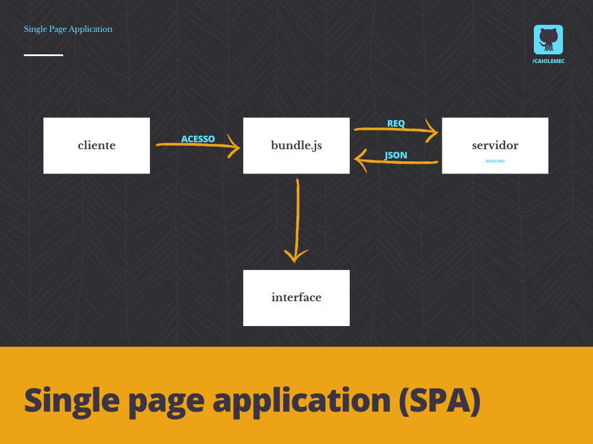
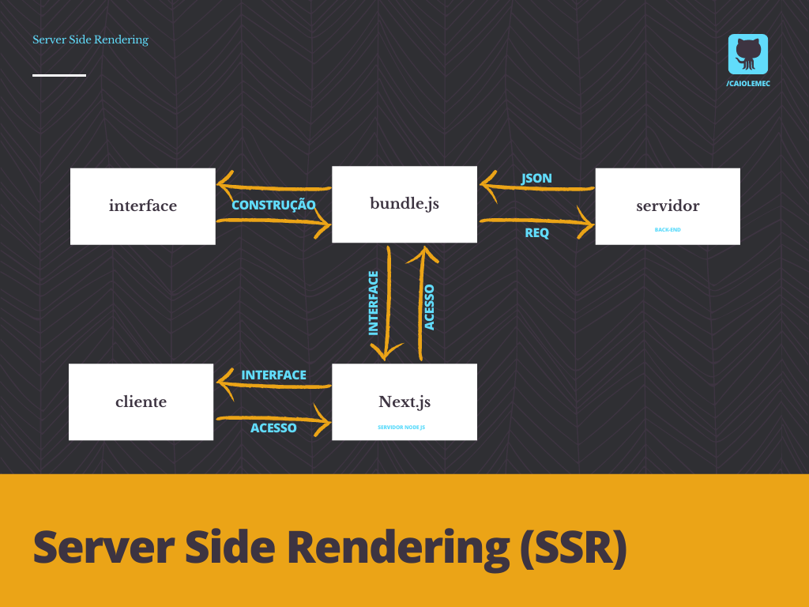
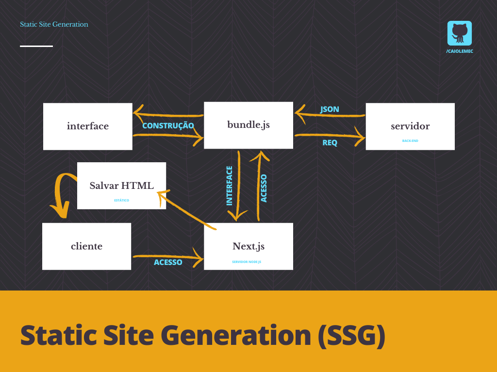
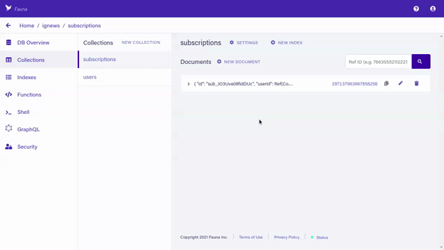
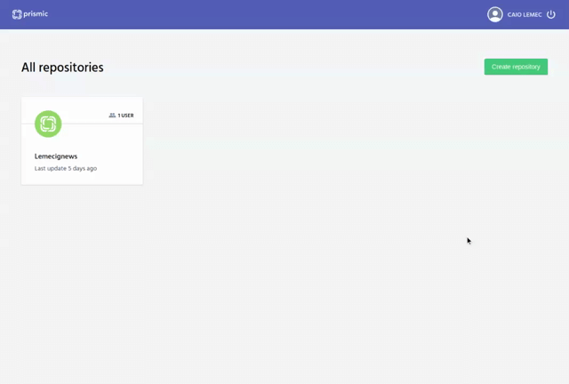

## NextJS
<br>
<h3>O que é o <b>Next.js</b>?</h3>

<b>Next.js</b> é caixa de ferramentas que irá auxiliar o desenvolvimento front-end principalmente somado com o uso da biblioteca React. Através dele é permitido realizar funcionalidades como renderização do lado do servidor e geração de sites estáticos para aplicativos da web.
<br>
<hr>


<h3>Por que usar <b>Next.js</b>?</h3>

Para entender o motivo de usar <b>Next.js</b> é necessário primeiro entender conceitos básicos de <b>SEO</b>.
<br>
<b>SEO (Search Engine Optimization)</b>  é um conjunto de estratégias que tem como objetivo melhorar posicionamento nos resultados dos buscadores, ou seja, pode significar um maior número de acessos por proporcionar colocações superiores nos resultados de pesquisas nos buscadores.
<br>
<hr>

<h3>Como o <b>Next.js</b> pode me ajudar a melhorar uma dessas estratégias?</h3>

Crawler, é um robô usado pelos buscadores para encontrar e indexar páginas de um site. Ele captura informações das páginas e cadastra os links encontrados, possibilitando encontrar outras páginas e mantendo sua base de dados atualizada. Então visando otimizar resultados uma das estratégias é facilitar a vida desses robôs e fornecer tudo que eles precisarem quando for requisitado.

O grande problema é que muitos desses robôs, realizam essa "varredura" com a função de javascript desligada e ou não podem esperar o javascript renderizar os elementos dificultando tanto o SEO quanto usuários que possuem dispositivos móveis antigos e ou conexões fracas.

Quando realizamos aplicações com react tradicional as interfaces são construídas pelo browser (SPA) e carregam seu conteúdo através de bundles, desta forma, motores de buscam podem ter problemas ao tentarem indexar conteúdo. Com o <b>Next.js</b> o código que renderiza a interface é executada por um servidor Node.js, o cliente vai ficar aguardando até o processo ser concluído. 

Vamos entender os conceitos de <b>SPA</b>, <b>SSR</b> & <b>SSG</b>:
<br>

<b>SPA (Single-page Application)</b>: São sempre executadas do lado do cliente (browser). O conteúdo de uma aplicação SPA é carregado completamente logo na primeira requisição. Exemplo: Github até a data que este conteúdo foi escrito.
<br>
<p align="center"></p>

>Consumindo api utilizando SPA:
```bash

useEffect(()=> {
fetch('url')
.then(response => response.json())
.then(data => console.log(data))
}, [])

```

<b>SSR (Server-side Rendering)</b>: O SSR é utilizado para resolver alguns dos problemas das aplicações SPAs porém, tentando manter suas principais vantagens. O SSR inverte o processo de renderização, trazendo uma parte do esforço de renderização de aplicações SPA para o servidor, de maneira similar ao carregamento tradicional. Mais dinâmico porém menos performático SSR é usado majoritariamente quando é necessário indexação e quando é preciso de dados dinâmicos como por exemplo: Informações em tempo real sobre usuário.
<br>
<p align="center"></p>

>Para consumir uma api via SSR e não no CSR (client side rendering) é necessário que a chamada seja feita em uma página no Next e não em um component. 

Exemplo:

```bash

export async function getServerSideProps() {
    const response = await fetch ('url')
    const data = await response.json()

    return {
        props: {
            dados: dados,
        }
    }
}
```

> Todo o código dentro da function getServerSideProps será executado dentro do servidor node.

<b>SSG (Static Site Genaration)</b>: O SSG passa por um processo bem semelhante do SSR, porem em suas ultimas etapas, ele cria um arquivo HTML estático que ficará salvo e é servido para um próximo acesso no client. Menos dinâmico e mais performático SSG é usado majoritariamente quando é necessário indexação e também gerar um HTML para muitos acessos. EX: Home de um blog.
<br>
<p align="center"></p>

Exemplo:

```bash

export async function getStaticProps() {
    const response = await fetch ('url')
    const data = await response.json()

    return {
        props: {
            dados: dados,
        },
        revalidate: 60 * 60 * 8,
    }
}

```

> O revalidate é a cadência em tempo que o Next vai salvar o novo HTML para servir ao client.

<br>
<hr>


<h3>Como usar <b>Next.js</b>?</h3>

Para criar uma estrutura usando <b>Next.js</b> basta usar o comando:

```bash
yarn create next-app nome-do-app
```

A estrutura criada será bem semelhante a criada com ```create react-app``` porém são adicionadas diversas funcionalidades, muitas delas automatizadas que ajudarão no desenvolvimento.

A pasta `pages` criada, não pode ser renomeada e sempre deverá ficar ou na raiz ou dentro de uma pasta SRC, isto pelo fato de cada arquivo que é atribuído a ela, vira automaticamente uma rota. Sendo assim, index sempre será o arquivo principal da aplicação. 

Arquivo _app é um componente que está por volta de todos outros componentes. Tudo que estiver dentro dele, será carregado assim houver uma troca na rota.

Arquivo _document é como se fosse o index em um projeto com React, nele serão feitas as implementações de coisas que ficarão estáticas mesmo ao trocar rota.

> Arquivos como _app e _document não viram rotas.

<br>
<hr>


<h3>Como adicionar <b>Typescript</b> no <b>Next.js</b></h3>

Para adicionar <b>Typescript</b> no <b>Next.js</b> basta usar o comando:

```bash
yarn add typescript @types/react @types/node -D
```
> @types/react & @types/node são para adicionar os pacotes de tipagem.

Após a instalação desses pacotes, basta alterar os arquivos para ts ou tsx. 

> O arquivo tsconfig.json será gerado automaticamente ja com as configurações necessárias para utilização do Typescript.

<br>
<hr>


<h3>E a estilização?</h3>

O ideal é proporcionar aos projetos a estratégia de botar as estilizações em um escopo, justamente para evitar possíveis interferências. Então é necessário utilizar de uma funcionalidade nativa do <b>Next.js</b>, que atribuí um hash único ao elemento: <b>CSS modules</b> com um pré-processador <b>SASS</b>.

<br>
<hr>

<h3>API roots?</h3>

A API Routes permite criar API com NextJS, onde o NodeJS consegue roda por baixo dos panos, proporcionando assim uma maior segurança para o tratamento de dados.
Para isso é necessário que nossa API esteja na pasta pages dentro da pasta api.
Exemplo: /pages/api/users.ts 

```bash

import { NextApiRequest, NextApiResponse} from 'next';

export default (request: NextApiRequest, response: NextApiResponse) => {
    const users = [
        {id: 1, name: 'Caio'},
        {id: 2, name: 'Caiow'},
        {id: 3, name: 'Caioz'},
    ]

    return response.json(users)
}

```
Agora você consegue acessar esse "backend" da camada do Next pela rota '/api/users'.

> Porque o arquivo é .ts e não .tsx? Lembre-se arquivos tsx são usados quando queremos usar elementos JSX.

<br>
<hr>

## Configuração dos serviços externos:

<b>Ignews</b> é um app JAMStack que utiliza [FaunaDB](https://fauna.com/), [Stripe](https://stripe.com/br) e [Prismic](https://prismic.io/) para seu funcionamento.

> JAMStack = Arquitetura de desenvolvimento web moderna baseada em JavaScript do lado do cliente, APIs reutilizáveis e marcação pré-construída. Você pode checar mais informações acessando: [JAMStack](https://jamstack.org/).

<hr>

<h3><b>Stripe</b>:</h3>

<b>Stripe</b> é uma plataforma de pagamentos, que permite usuários realizarem pagamentos via cartão de crédito.

Após acessar o site e criar sua conta, vá até `Products` e adicione um produto de teste.

Você vai editar os seguintes campos:

```bash
Name: Subscription 
Price: 9,90 - USD - Recurring
Billing Period: Monthly 
```

Para customizar a página que redireciona o usuário ao pagamento basta acessar: `settings -> branding`.

Você pode testar pagamentos com base no link: https://stripe.com/docs/testing

<hr>
<br>

<h3><b>FaunaDB</b>:</h3>

<b>FaunaDB</b> é um banco de dados muito utilizado em projetos serveless.

Após acessar o site e criar sua conta, crie uma nova base de dados seguindo a tabela:

<p align="center">

</p>

<b>Collections</b>:

```bash
  {
    name: "subscriptions",
    history_days: 30,
    ttl_days: null
  }

  {
    name: "users",
    history_days: 30,
    ttl_days: null
  }
  ```

  <b>Index</b>:

```bash
  {
    name: "subscriptions",
    history_days: 30,
    ttl_days: null
  }

  {
    name: "subscription_by_id",
    unique: false,
    serialized: true,
    source: "subscriptions",
    terms: [
      {
        field: ["data", "id"]
      }
    ]
  }

  {
    name: "subscription_by_status",
    unique: false,
    serialized: true,
    source: "subscriptions",
    terms: [
      {
        field: ["data", "status"]
      }
    ]
  }

  {
    name: "subscription_by_user_ref",
    unique: false,
    serialized: true,
    source: "subscriptions",
    terms: [
      {
        field: ["data", "userId"]
      }
    ]
  }

  {
    name: "user_by_email",
    unique: true,
    serialized: true,
    source: "users",
    terms: [
      {
        field: ["data", "email"]
      }
    ]
  }

  {
    name: "user_by_stripe_customer_id",
    unique: false,
    serialized: true,
    source: "users",
    terms: [
      {
        field: ["data", "stripe_customer_id"]
      }
    ]
  }
  ```

<hr>
<br>

<h3><b>Prismic</b>:</h3>

Após criar sua conta e seu repositório, vá até a aba `custom types` e crie uma nova deixando selecionado `Repeatable Type` e entrando com o nome `post`:

<p align="center">

</p>

Agora você deve construir o elemento:

Arraste UID para o campo de construção:
```bash
Field name: UID
```
Arraste Title field para o campo de construção:
```bash
Field name: Title
API ID: title
Deixe o campo h1 selecionado.
```

Arraste Rich Text field para o campo de construção:
```bash
Field name: Content
API ID: content
Deixe todos os campos selecionados.
```

<p align="center">

</p>


Após esses passos será possível adicionar novos posts a aplicação. Para isso, basta ir na aba `documents` e adicionar o conteúdo. 😇

<hr>
<br>


 


